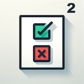

<div align="center">
  <h1 align="center">✅QuadraVoice❌</h1>
  <h3>Substrate runtime for quadratic voting</h3>
  

</div>
<div style="text-align: justify">
"In the dynamic landscape of digital decision-making, QuadraVoice emerges as the premier quadratic voting app, powered by the robust Substrate framework. Citizens actively wield their influence with mathematical precision, shaping the present and future through their choices, creating a harmonious symphony of voices. QuadraVoice not only ensures the meticulous safeguarding of voting minorities but also brings unparalleled benefits to the Polkadot ecosystem. By seamlessly integrating with the Polkadot network, QuadraVoice enhances the decentralized ethos, contributing to a more interconnected and resilient digital society. QuadravVoice is built with Substrate and FRAME, which fortifies its security and scalability but also positions it as a valuable player in the broader Polkadot ecosystem, championing democratic values and promoting inclusivity in the ever-evolving world of digital governance. Using a quadrating voting system, QuadraVoice is hell-bent on protecting minorities from the vicious whales that might want to turn the tide of the vote. With QuadraVoice, every vote matters, and one vote can change the outcome!"
</div>

<p style="text-align: center;">Built using FRAME, Substrate and Rust.</p>

## Project considerations

### Storage
- A map of all the accounts that have been registered to vote.
```
pub type RegisteredAccounts<T: Config> = StorageMap<_, Blake2_128Concat, T::AccountId, bool>;
```	

- A value that increments with the number of proposals created. It holds the next available id.
```
pub type ProposalIndex<T: Config> = StorageValue<_, T::ProposalId, ValueQuery>;
```	

- A map of all the proposals.
```
pub type ProposalPool<T> = StorageMap<_, Blake2_128Concat, T::ProposalId, Proposal<T>>;
```	

- A map of the voting history of every account. It only keeps track for active proposals or if the user hasn't claimed back the tokens after a proposal has ended.
```
pub type VotingHistory<T: Config> = StorageMap<_, Blake2_128Concat, T::AccountId, BoundedVec<UserVoteInfo<T>, T::MaxVotes>>;
```	

### Voting process
- A root account registers voters.
- A registered voter makes a proposal.
- Voters vote on the proposal, locking a number of tokens based on their conviction, for a certain lock period.
- Anyone can try to end the vote at any time, but the vote will not be ended until after the lock period has pased.

## Overview
The Quadratic Voting pallet handles the administration of voting mechanisms using a quadratic approach. There is one pool that the proposals are added into that the voter can choose
to vote on. The proposals have a configurable duration that starts from the moment the proposal is created and is counted in block numbers. It has to be manually closed. The voters will vote in approval ("Aye") or rejection ("Nay"), choosing how many votes they want to add to their choice and locking the square of the votes as tokens. The voters have the chance to unlock their tokens after the proposal has been closed.

### Terminology
- **Lock Period:** A period of time after proposal enactment that the vote cannot be ended and the locked tockens cannot be redeemed.
- **Conviction:** An indication of a voter's strength of belief in their vote. An increase in conviction indicates that a token holder is willing to lock the square of their votes as tokens.
- **Vote:** A value that can either be in approval ("Aye") or rejection ("Nay") of a particular referendum.
- **Proposal:** A submission to the chain that represents an action that a proposer (either an account or an external origin) suggests that the system adopt.
## Interface

### Dispatchable Functions
#### Public
These calls can be made from any externally held account capable of creating a signed extrinsic.
- `end_vote` - Will end the vote if the time allocation has expired.
#### Registered users
These calls can only be made by an account that has been registered into the pool.
- `make_proposal` - Submits a proposal, represented as a hash.
- `vote` - Votes for a proposal, either the vote is "Aye" to enact the proposal or "Nay" to keep the status quo. The number of votes scales quadratically with the tokens frozen as a deposit.
- `claim_frozen_tokens` The voter can claim the frozen tokens used for a proposal, after the proposal ends.
#### Root
These calls can only be made by a root account.
- `register_voters` - Registers an account into a pool of voters. Requires sudo.


## Possible improvements
- Implement a system to vote on more proposals at once.
- Make a certain majority of voters configurable (51% of registered voters for example). 

## Compromises
- The freezing and unfreezing logic is not optimized for storage access.

## Requirements

Before you begin, you need to install the following tools:

- [Git](https://git-scm.com/downloads)
- [Rust and the Rust toolchain](https://docs.substrate.io/install/)

## Quickstart

Please first check the latest information on getting starting with Substrate dependencies required to build this project [here](https://docs.substrate.io/main-docs/install/).

### Development Testing

To test while developing, without a full build (thus reduce time to results):

```sh
cargo t -p pallet-voting
```

### Build

Build the node without launching it, with `release` optimizations:

```sh
cargo b -r
```

### Run

Build and launch the node, with `release` optimizations:

```sh
cargo r -r -- --dev
```

### CLI Docs

Once the project has been built, the following command can be used to explore all CLI arguments and subcommands:

```sh
./target/release/node-template -h
```

## Contributing

QuadraVoice is an open-source project. We welcome contributions from the community. If you'd like to contribute, please fork the repository and make changes as you'd like. Pull requests are welcome.


## Additional resources

- [Quadratic Voting in Blockchain Governance](https://www.mdpi.com/2078-2489/13/6/305)


### Setup

Please first check the latest information on getting starting with Substrate dependencies required to build this project [here](https://docs.substrate.io/main-docs/install/).

### Development Testing

To test while developing, without a full build (thus reduce time to results):

```sh
cargo t -p pallet-voting
```

### Build

Build the node without launching it, with `release` optimizations:

```sh
cargo b -r
```

### Run

Build and launch the node, with `release` optimizations:

```sh
cargo r -r -- --dev
```

### CLI Docs

Once the project has been built, the following command can be used to explore all CLI arguments and subcommands:

```sh
./target/release/node-template -h
```
